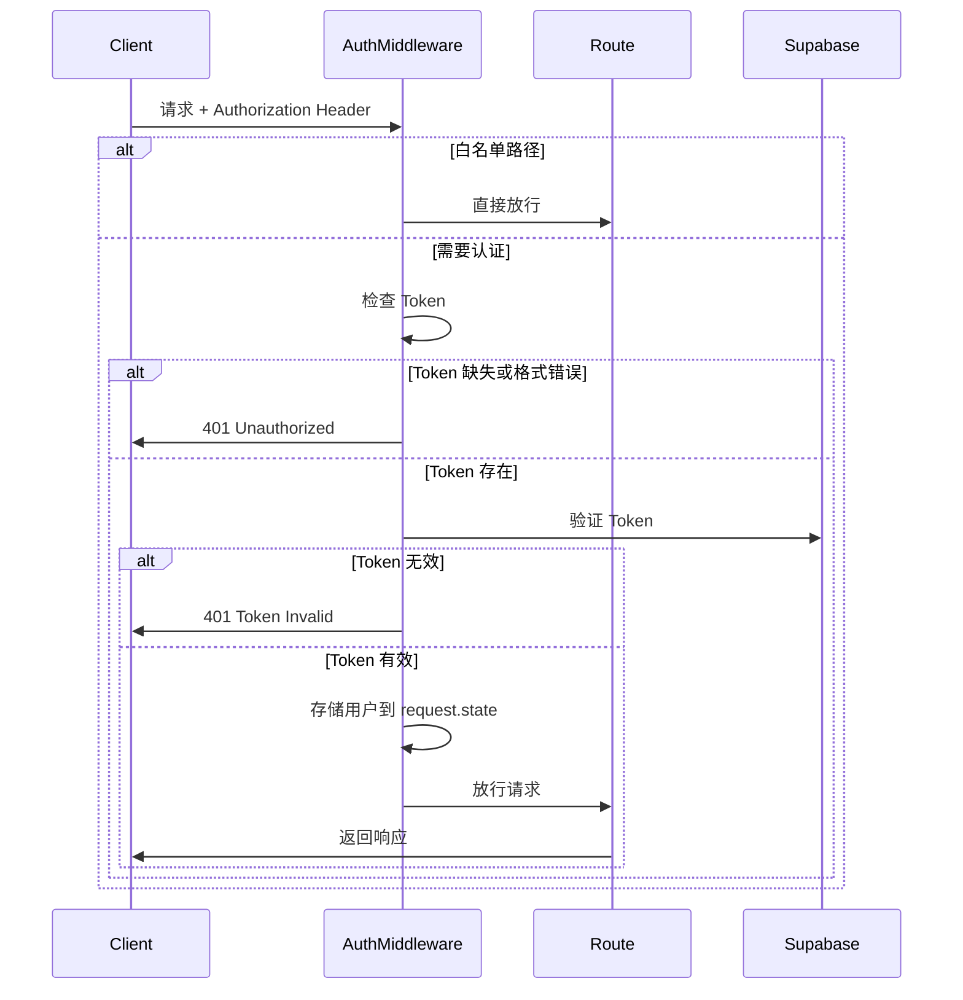

# 全局认证中间件使用指南

## 概述

本项目实现了类似 **Java Spring Security** 的全局认证拦截器，默认所有接口都需要认证，只有配置在白名单中的路径才可以匿名访问。

## 特性

- ✅ **全局拦截**：默认所有路径都需要认证
- ✅ **白名单配置**：支持精确匹配和正则表达式模式匹配
- ✅ **中心化管理**：在 `app/core/auth_config.py` 统一配置
- ✅ **易于使用**：类似 Spring Security 的使用体验
- ✅ **灵活控制**：可以通过参数启用/禁用全局认证

## 快速开始

### 1. 启用全局认证

在 `app/main.py` 中已经默认启用：

```python
from app.middleware.auth import AuthMiddleware

# 启用全局认证中间件
app.add_middleware(AuthMiddleware, enable=True)
```

### 2. 配置白名单

在 `app/core/auth_config.py` 中配置不需要认证的路径：

```python
# 精确匹配
PUBLIC_PATHS: Set[str] = {
    "/",
    "/health",
    "/api/auth/login",
    "/api/auth/register",
}

# 正则表达式匹配
PUBLIC_PATH_PATTERNS: List[str] = [
    r"^/docs.*",      # 匹配 /docs, /docs/, /docs/xxx
    r"^/api/public/.*",  # 匹配 /api/public/xxx
]
```

### 3. 在路由中获取当前用户

**方式一：从 Request 获取（推荐）**

```python
from fastapi import Request
from app.middleware.auth import get_current_user_from_request
from app.core.response import success

@router.get("/profile")
async def get_profile(request: Request):
    # 获取当前登录用户（已通过中间件验证）
    user = get_current_user_from_request(request)
    return success(data=user)
```

**方式二：使用依赖注入（原有方式，仍然支持）**

```python
from app.core.dependencies import CurrentUser
from app.core.response import success

@router.get("/profile")
async def get_profile(current_user: CurrentUser):
    return success(data=current_user)
```

## 详细说明

### 认证流程



### 白名单配置规则

#### 1. 精确匹配 (PUBLIC_PATHS)

```python
PUBLIC_PATHS = {
    "/",                    # 根路径
    "/health",              # 健康检查
    "/api/auth/login",      # 登录接口
    "/api/auth/register",   # 注册接口
}
```

- 完全匹配路径
- 区分大小写
- 不支持通配符

#### 2. 模式匹配 (PUBLIC_PATH_PATTERNS)

```python
PUBLIC_PATH_PATTERNS = [
    r"^/docs.*",           # 匹配以 /docs 开头的所有路径
    r"^/api/public/.*",    # 匹配 /api/public/ 下的所有路径
    r"^/static/.*",        # 匹配静态文件
]
```

- 使用 Python 正则表达式
- `^` 表示开头，`.*` 表示任意字符
- 注意使用原始字符串 `r"..."`

### 用户信息获取

中间件验证通过后，用户信息会存储在 `request.state.current_user` 中：

```python
{
    "id": "user-uuid",
    "email": "user@example.com",
    "user_metadata": {...},
    "created_at": "2024-01-01T00:00:00Z"
}
```

使用辅助函数获取：

```python
from app.middleware.auth import get_current_user_from_request

user = get_current_user_from_request(request)
if user:
    user_id = user["id"]
    email = user["email"]
```

## 常见使用场景

### 场景 1：添加公开 API

如果要添加一个不需要认证的公开接口：

```python
# 在 app/core/auth_config.py 中添加
PUBLIC_PATHS.add("/api/public/info")
```

### 场景 2：添加一组公开路径

如果要添加一组路径（例如 `/api/public/*` 下的所有接口）：

```python
# 在 app/core/auth_config.py 中添加
PUBLIC_PATH_PATTERNS.append(r"^/api/public/.*")
```

### 场景 3：临时禁用全局认证

在开发或测试时，可以临时禁用全局认证：

```python
# 在 app/main.py 中修改
app.add_middleware(AuthMiddleware, enable=False)
```

### 场景 4：获取用户信息并进行权限检查

```python
@router.post("/orders")
async def create_order(request: Request, order_data: OrderCreate):
    user = get_current_user_from_request(request)
    
    # 进一步的权限检查
    if not user.get("user_metadata", {}).get("is_premium"):
        raise HTTPException(
            status_code=403,
            detail="Premium membership required"
        )
    
    # 创建订单逻辑
    order = await create_order_service(user["id"], order_data)
    return success(data=order)
```

## 对比：Spring Security vs FastAPI Auth Middleware

| 特性 | Spring Security | FastAPI Auth Middleware |
|------|----------------|-------------------------|
| 配置方式 | Java 注解 + 配置类 | Python 配置文件 |
| 白名单 | `.antMatchers().permitAll()` | `PUBLIC_PATHS` / `PUBLIC_PATH_PATTERNS` |
| 获取用户 | `@AuthenticationPrincipal` | `get_current_user_from_request()` |
| 全局启用 | `@EnableWebSecurity` | `app.add_middleware(AuthMiddleware)` |
| 拦截器 | `HandlerInterceptor` | `BaseHTTPMiddleware` |

## 示例：完整的路由文件

```python
from fastapi import APIRouter, Request
from app.middleware.auth import get_current_user_from_request
from app.core.response import success, error
from app.core.response_code import ResponseCode

router = APIRouter()

# ✅ 这个接口需要认证（不在白名单中）
@router.get("/profile")
async def get_profile(request: Request):
    """获取用户个人信息"""
    user = get_current_user_from_request(request)
    return success(data=user)

# ✅ 这个接口需要认证
@router.put("/profile")
async def update_profile(request: Request, profile_data: dict):
    """更新用户个人信息"""
    user = get_current_user_from_request(request)
    
    # 更新逻辑
    updated_user = await update_user_service(user["id"], profile_data)
    return success(data=updated_user)

# ✅ 这个接口需要认证，并进行额外的权限检查
@router.delete("/account")
async def delete_account(request: Request):
    """删除用户账号"""
    user = get_current_user_from_request(request)
    
    # 额外的权限检查
    if not user.get("user_metadata", {}).get("can_delete"):
        return error(
            code=ResponseCode.FORBIDDEN,
            msg="You don't have permission to delete account"
        )
    
    # 删除逻辑
    await delete_user_service(user["id"])
    return success(msg="Account deleted successfully")
```

## 注意事项

1. **白名单路径必须完整**
   - ❌ 错误：`/auth` （会匹配 `/auth`，但不会匹配 `/auth/login`）
   - ✅ 正确：`/auth/login` 或使用模式 `r"^/auth/.*"`

2. **中间件执行顺序**
   - 中间件的添加顺序很重要
   - 后添加的中间件先执行
   - 当前顺序：CORS → Logging → Auth → ErrorHandler

3. **Token 格式**
   - 必须使用 Bearer Token
   - 请求头格式：`Authorization: Bearer <token>`

4. **性能考虑**
   - 每次请求都会验证 Token（调用 Supabase API）
   - 白名单路径不会调用验证，性能更好
   - 可以考虑添加 Token 缓存机制（未来优化）

## 故障排查

### 问题 1：接口返回 401 Unauthorized

**原因**：
- Token 缺失或格式错误
- Token 已过期
- Token 无效

**解决**：
- 检查请求头是否包含 `Authorization: Bearer <token>`
- 确认 Token 是从 Supabase 获取的有效 Token
- 尝试重新登录获取新 Token

### 问题 2：公开接口仍然需要认证

**原因**：
- 路径没有添加到白名单
- 路径匹配规则不正确

**解决**：
- 检查 `app/core/auth_config.py` 中的配置
- 确认路径完全匹配或正则表达式正确
- 重启服务器使配置生效

### 问题 3：获取不到用户信息

**原因**：
- 接口在白名单中（不会验证 Token）
- 中间件未正确存储用户信息

**解决**：
- 确认接口不在白名单中
- 检查 `get_current_user_from_request()` 返回值
- 查看日志确认中间件是否正常执行

## 总结

全局认证中间件提供了类似 Java Spring Security 的使用体验，让你可以：

- ✅ 统一管理认证逻辑
- ✅ 中心化配置白名单
- ✅ 减少重复代码
- ✅ 更好的安全性（默认需要认证）

推荐在所有新项目中使用这种方式！

